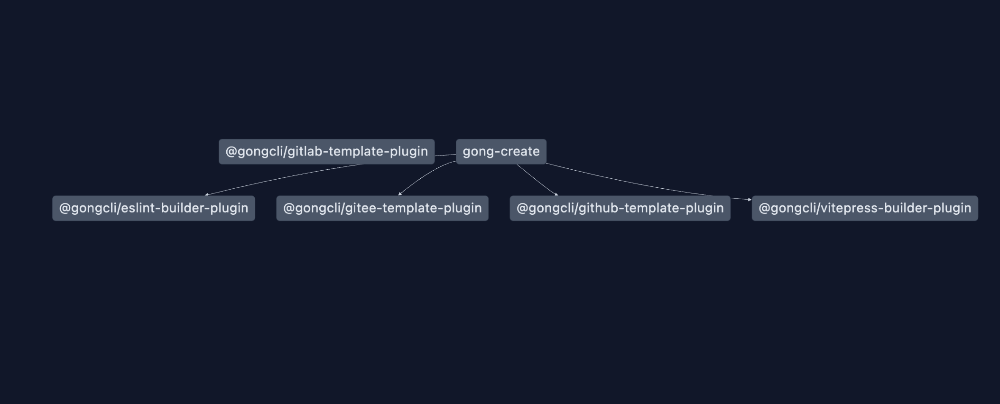

# gong-create




## What

The goal is to create a universal CLI engine that can serve as a scaffold for scaffolds.

Users can extend and customize their own scaffolds through a plugin system.


## Install
> node version >= 18.0.0

Note: Since the plugin installation defaults to using pnpm as the package manager, you need to install pnpm.

```bash
npm -g install pnpm
```

CLI usage
```bash
npx gong-create@latest
```

If you just want to init eslint, you can 

```base
npx gong-create@latest --lint
```
then reinstall the dependency

please note that the use of cli requires a node version of 18 or above, so you need to change the node first. 

If you just init a docs, you can 

```base
npx gong-create@latest --docs
```

## Feature

- Independent project templates
- Template sources support GitHub, GitLab, and Gitee
- Provides common generator features

### Usage

[Video Link](https://www.yuque.com/gongxiaobai/ckuidk/wp6gx65o7ezn0ud1)

This project classifies template projects into three categories:

- Project Type: Business Project, Component Project, CLI Project
- Framework: React, Vue
- Repository Management: Monorepo, Single Repo

Therefore, if you want to set up your own template, you need to follow a specific naming convention.

For example, "template-react-monorepo" represents a React monorepo template. If no project type is specified, it matches all types.

If you don't like the above three classification methods, it's okay. It's also easy to configure your own.
Find core/cli.config.json and modify the configData field.

```json
{
  "name": "gong-cl",
  "userPath": "gong-cli",
  "configData": [
    {
      "name": "project",
      "label": "项目类型",
      "type": "select",
      "title": "请选择所要创建的项目类型",
      "items": [
        {
          "label": "业务",
          "value": "business"
        },
        {
          "label": "库",
          "value": "lib"
        },
        {
          "label": "脚手架",
          "value": "cli"
        }
      ]
    },
    {
      "name": "codeManagement",
      "label": "仓库管理方式",
      "type": "select",
      "title": "请选择仓库管理方式",
      "items": [
        {
          "label": "单库项目",
          "value": "singlerepo"
        },
        {
          "label": "多库管理",
          "value": "monorepo"
        }
      ]
    },
    {
      "name": "frame",
      "label": "框架类型",
      "type": "select",
      "title": "请选择框架",
      "items": [
        {
          "label": "React",
          "value": "react"
        },
        {
          "label": "Vue",
          "value": "vue"
        },
        {
          "label": "None",
          "value": "none"
        }
      ]
    }
  ]
}
```
- name: Unique key for the current option control (required)
- label: Label for the option control (required)
- type: Type of the option control (required)
  - select: Dropdown
  - input: Input field
- items: (required for type "select"): Options for the dropdown
- label: Label of the option
- value: Value of the option


However, it is still important to follow certain naming conventions for the templates, otherwise the engine will not be able to recognize them. For example: ['cli','singlerepo','react'] => template-cli-singlerepo-react


#### How to use privately
There are currently two public configuration properties in the platform:

- name: CLI name, the logo title when the CLI starts
- userPath: User or organization name of the personal repository, e.g.: https://github.com/gong-cli, then "gong-cli" is the userPath; https://github.com/gong9, then "gong9" is the userPath; https://gitee.com/gong9/, "gong9" is also the userPath. Set this property correctly to ensure that the engine can access your template repository.

Setting method:

```bash
pnpm start -c
```

This command also supports setting when deploying:
    
```bash
npx gong-create@latest -c
```

#### How to use plugins
If your template repository is on GitHub, GitLab, or Gitee, you need to use the plugin functionality of this project to install the download plugin for the specified platform locally.
> For development purposes only. After configuration, it is recommended to package and publish privately. (i.e., change the package name to your own; it is not recommended to modify the project for future use of the plugin ecosystem)

Open the plugin store and install the plugin:
```bash
pnpm start -p
```

After installation, you need to enable the plugin:
```bash
pnpm start -l
```
Note: The plugin engine will only use one download plugin. (At present, the plugin functionality is not fully developed, and only the GitHub and Gitee download plugins have been developed, which do not require tokens.)


